# Factory Operations and Operator Assignment Data Pipeline
**Author:** Kacper Prorok  
**Tech Stack:** Python, Streamlit, Databricks (PySpark, SQL), Delta Lake, Power BI

**Date of first release: 09.2026**
---

A comprehensive end-to-end system for tracking, processing, and analyzing operator working hours across manufacturing cells. This project covers the entire data lifecycle: from custom event logging via a lightweight web application, through scalable Big Data transformations in Databricks, to executive reporting in Power BI.

---

## Business Context & Problem Statement

In manufacturing environments with cyclical production schedules—such as facilities operating on a two-week production run followed by scheduled downtime—workforce allocation is a critical operational challenge. In this plant, leadership lacked visibility into where shop-floor operators were physically deployed, how non-production time was utilized, and the exact distribution of hours between standard stations, temporary reassignments, and maintenance tasks.

The initial initiative proposed a low-code architecture:
* **Data Entry:** Microsoft Power Apps forms for manual shift logs.
* **Storage:** Microsoft SharePoint lists.
* **Transformation & Reporting:** Power BI with heavy Power Query (M) transformations to reconcile schedules, calculate intervals, and build dashboards.

### Limitations of the Initial Approach
During initial evaluation, several architectural bottlenecks were identified:
* **Scalability & Data Governance:** SharePoint lists lack transactional integrity, enforce strict delegation thresholds, and do not scale well with high-frequency time-series logging.
* **ETL Performance Bottlenecks:** Implementing complex timeline-slicing algorithms (interval breaking, window functions, and non-equi joins) inside Power Query severely degrades dataset refresh performance and introduces maintenance overhead.
* **Rigid User Experience:** Custom operational validations for shift exceptions were difficult to enforce cleanly within Power Apps without complex formula workarounds.

### The Modern Data Architecture Pivot
To deliver a robust, enterprise-grade solution, the stack was redesigned:
1. **Frontend (Streamlit):** Replaced Power Apps with an intuitive Python-based Streamlit web application, enforcing strict input validation for shift swaps, absences, and line reassignments.
2. **Data Lakehouse (Databricks):** Replaced SharePoint and Power Query with Databricks using Delta Lake and the Medallion Architecture (Bronze, Silver, Gold). Databricks handles raw JSON ingestion, SCD Type 2 mapping, and high-performance SQL/PySpark interval-splitting algorithms.
3. **Semantic Layer & Analytics (Power BI):** Relieved of transformation duties, Power BI now connects directly to Gold-layer fact and dimension tables, focusing entirely on DAX business measures, utilization KPIs, and interactive reporting.

---

## High-Level Architecture

The end-to-end data pipeline covers every phase of a modern analytics workflow:
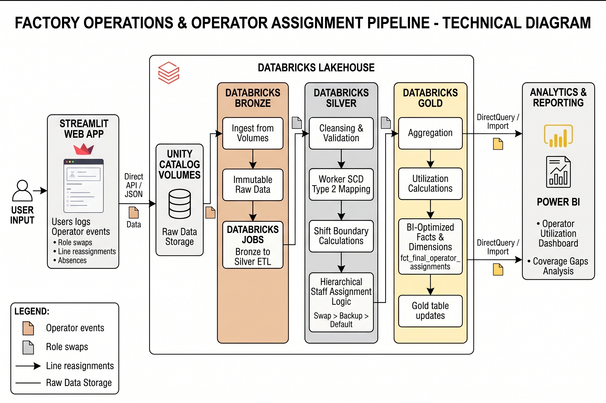

## Data Model and Business Process Insights

To fully grasp the architectural decisions made in the data pipeline, it is essential to understand the physical factory topology and the business rules governing workforce utilization. 

### Factory Topology and Production Scheduling
The manufacturing facility is organized hierarchically into **Production Lines**, which are further divided into individual **Workstations (Cells)**. 

The plant does not run all lines continuously. Instead, it operates on cyclical, demand-driven schedules (e.g., a line might run continuously for a two-week sprint, followed by a planned downtime period). Because operators are employed full-time regardless of line activity, plant management required a system to accurately track how workers utilized their time (e.g., maintenance, 5S, training) during non-production windows.

### Automated Staffing Logic (The Rules Engine)
To minimize manual data entry for planners, the data model incorporates an automated staffing inference engine based on baseline workstation assignments:
1. **Default Operator:** When a Production Plan is active for a specific line, the system automatically logs "Production Activity" time for the designated *Default Operator* of each cell on that line.
2. **Backup Operator (Fallback):** If the Default Operator logs an absence (e.g., sick leave or vacation), the pipeline automatically reassigns the cell's production hours to the designated *Backup Operator*.
3. **Unassigned Alert:** If both the default and backup operators are unavailable or engaged elsewhere, the system flags the workstation as "Unassigned/Empty." This acts as a critical visual trigger for the Shift Manager to intervene and staff the cell.

### Ad-Hoc Reallocation: The "Swap" Exception
Factory floors are highly dynamic, requiring manual overrides to standard plans. To accommodate this, the event logging form includes a specific activity type known as a **Swap**.

A Swap event occurs when a Shift Leader manually delegates a specific worker to operate a specific workstation. 
* **Highest Priority Override:** The Swap event bypasses the automated staffing logic. It forces the system to assign the worker to that cell, effectively overwriting the Default/Backup operator. Furthermore, a Swap can be executed even if there is no formal Production Plan active for that line (handling ad-hoc, unplanned production runs).
* **Reporting Categorization:** In the downstream Power BI dimensional model, time logged via a Swap event is strictly categorized and calculated as **Standard Production Time**, rather than an "Additional Activity", ensuring accurate labor cost allocation.


# Data Ingestion: Streamlit Web Application

To resolve data latency and eliminate manual paperwork or error-prone spreadsheets, a dedicated operational frontend was developed using Python and Streamlit. The application is hosted natively within the Databricks environment (Databricks Apps), providing seamless integration with the Lakehouse, automated session management, and direct connectivity to Unity Catalog without external authentication overhead.

---

## 1. User Interface and Operational Modules

The application consists of five dedicated operational views designed for shift leaders, cell coordinators, and production planners.

### Production Line and Cell Management

This view allows engineering and management teams to define and maintain the physical plant layout. Users can configure new production lines, declare workstations (cells), define operational descriptions, and inspect station sequencing in a clear hierarchical tree structure.

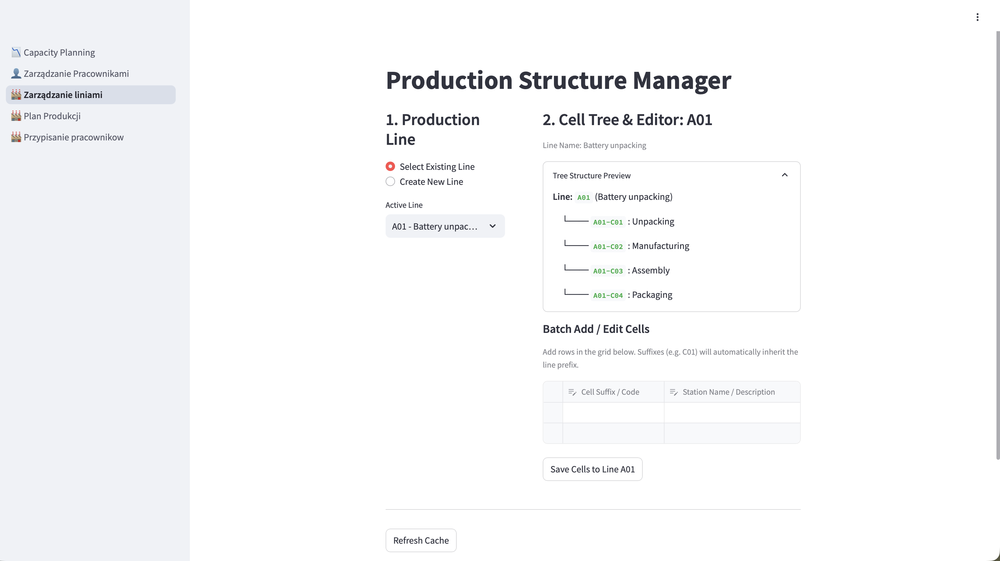

* **Key Capabilities:**
  * Master data creation for production lines and individual workstations.
  * Hierarchical tree view displaying operational dependencies and cell sequences.
  * Definition of station boundaries and functional activity descriptions.

### Operational Event and Exception Logger

Designed for rapid floor reporting, this interface enables supervisors and line operators to log real-time events that deviate from the standard operating schedule.

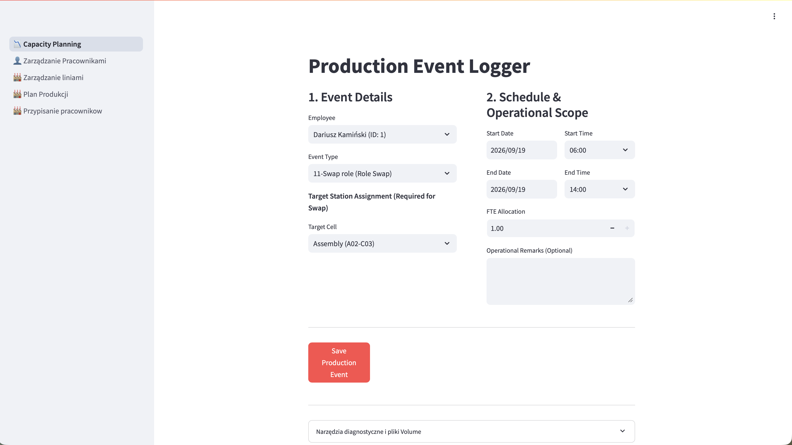

* **Key Capabilities:**
  * Real-time logging of operator role swaps, unplanned technical downtime, tooling changes, training intervals, and absences.
  * Direct operator self-service selection with dynamic input controls.
  * Timestamp-level granularity for capturing intra-shift staffing transitions.

### Station Staffing and Default Assignments

This module establishes base workforce allocation across production lines. Shift managers assign default operators and designate backup personnel to ensure coverage stability.

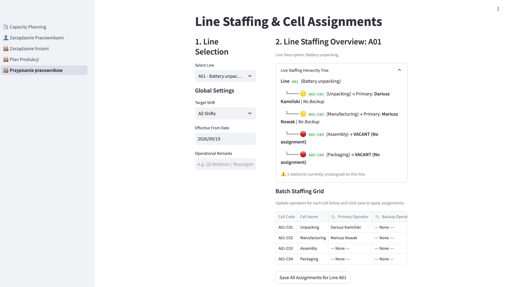

* **Key Capabilities:**
  * Assignment of primary and backup personnel per workstation with validity date boundaries (SCD Type 2).
  * Color-coded status indicators (e.g., green, yellow, red flags) providing immediate visual feedback on understaffed or unassigned cells.
  * Rapid reallocation controls to address staffing deficits ahead of planned shifts.

### Production Line Scheduling

Serving production planners, this view facilitates the definition of upcoming operating windows at the line level. When a line schedule is configured, the system automatically identifies all downstream cells impacted by the plan.

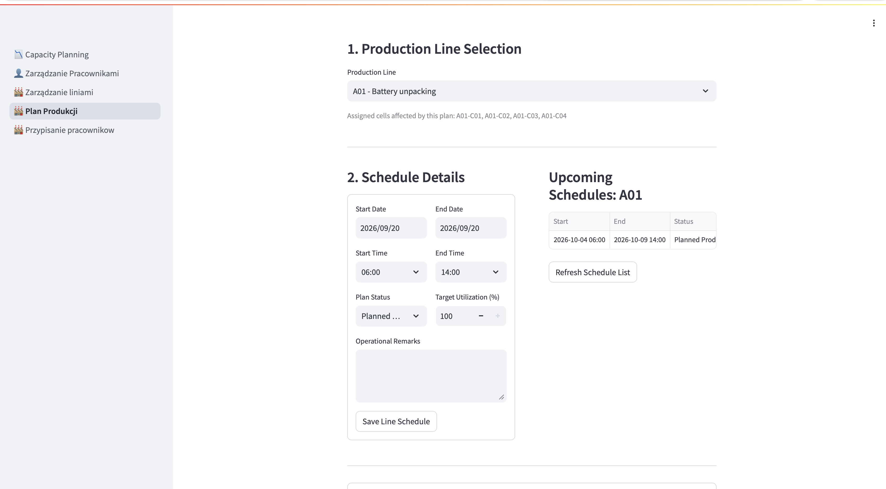

* **Key Capabilities:**
  * Scheduling of operational windows, maintenance shutdowns, and reduced capacity runs.
  * Real-time side-by-side view displaying active and upcoming schedules queried from the processed lakehouse layer.
  * Capacity threshold settings (Target Utilization %) linked directly to production planning.

### Workforce and Employee Management

A centralized administrative view for managing floor personnel records, onboarding, and availability statuses.

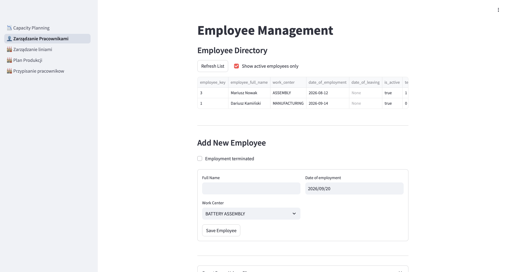

* **Key Capabilities:**
  * Maintenance of employee metadata, unique identifier keys, and active employment date ranges.
  * Instant status toggles to reflect current availability.
  * Comprehensive roster overview displaying current assignments and active shifts.

---

## 2. Technical Architecture and Implementation

Code for Streamlit Application can be found in this repo: https://github.com/kacpro94/factory-logger-streamlit

### Native Databricks Apps Hosting
By deploying the Streamlit interface directly inside Databricks Apps, the application leverages built-in OAuth context:
* Eliminates the need for hardcoded Personal Access Tokens (PAT) or exposed service credentials.
* Operates within the virtual private cloud (VPC) boundaries of the workspace, securing communication between frontend and data stores.

### Command Query Responsibility Segregation (CQRS)
The frontend separates read and write pathways to optimize performance:
* **Read Path (Statement Execution API):** Reference tables (`dim_production_cells`, `silver_production_plan`) are queried using the Databricks SQL Statement Execution API against an active serverless SQL Warehouse.
* **Write Path (Unity Catalog Volumes):** Rather than performing row-level SQL `INSERT` operations—which can lock tables and degrade Delta performance on high-frequency transactions—form submissions are serialized into JSON files and pushed directly to an append-only Bronze Volume (example: `/Volumes/data_warehouse_factory/bronze/production_plan_raw/`).

### State Management and Cache Strategy
To minimize warehouse compute costs and maintain UI responsiveness:
* Low-frequency structural queries use `@st.cache_data(ttl=300)`.
* Active schedule previews utilize `@st.cache_data(ttl=60)`.
* Immediate cache invalidation (`fetch_upcoming_plans.clear()`) is triggered upon form submission, ensuring newly submitted schedules render without manual page reloads.

### Data Ingestion Code Snippet

The following Python excerpt demonstrates how schedule submissions are validated, structured, and uploaded to the Unity Catalog Bronze storage layer via the Databricks SDK. Below there is example for View Production Plan

```python
from datetime import datetime
import json
from databricks.sdk import WorkspaceClient

# Initialize authenticated workspace client
w = WorkspaceClient()

def persist_schedule_payload(selected_line, assigned_cells, start_dt, end_dt, status, capacity, remarks):
    # Form payload structure
    payload = {
        "record_type": "LINE_SCHEDULE",
        "line_code": selected_line["line_code"],
        "line_name": selected_line["line_name"],
        "assigned_cells": assigned_cells,
        "start_datetime": start_dt.isoformat(),
        "end_datetime": end_dt.isoformat(),
        "plan_status": status,
        "planned_capacity_pct": capacity,
        "remarks": remarks.strip() if remarks else None,
        "ingested_at": datetime.now().isoformat(),
        "source": "streamlit_production_planner"
    }

    # Generate unique timestamped filename
    timestamp_str = datetime.now().strftime('%Y%m%d_%H%M%S_%f')
    filename = f"plan_line_{selected_line['line_code']}_{timestamp_str}.json"
    cloud_path = f"/Volumes/data_warehouse_factory/bronze/production_plan_raw/{filename}"

    # Stream JSON payload into Unity Catalog Volume
    json_bytes = json.dumps(payload, indent=4, ensure_ascii=False).encode('utf-8')
    w.files.upload(cloud_path, json_bytes)
```

# Data Platform: Databricks and Medallion Architecture

The core data engineering pipeline is implemented in Databricks, transforming raw telemetry into structured, business-ready models following the Medallion Architecture pattern (Bronze, Silver, Gold).

---

## Bronze Layer: Raw Data Ingestion and Storage

The Bronze layer serves as an append-only, immutable landing zone. Raw JSON payloads generated by the Streamlit application and upstream operational schedules are ingested directly into managed Delta tables without applying destructive schema transformations.

### Ingestion Mapping

Raw JSON payloads staged across Unity Catalog Volumes map directly to corresponding Bronze Delta tables:

| Source Volume Path (`/Volumes/...`) | Target Bronze Table | Business Domain |
| :--- | :--- | :--- |
| `.../employees_raw` | `bronze_employees` | Master employee records and contracts |
| `.../employee_assignments_raw` | `bronze_employee_assignments` | Workstation rosters and validity windows |
| `.../lines_cells_raw` | `bronze_production_structure` | Physical factory layout (lines and cells) |
| `.../production_plan_raw` | `bronze_production_plan` | Planned operating windows per line |
| `.../capacity_planner_events_raw` | `bronze_events` | Ad-hoc shift exceptions and operator swaps |

---

### Architectural Design and Technical Decisions

#### 1. Idempotent Ingestion via `COPY INTO`
Ingestion is executed using the Databricks SQL `COPY INTO` command to ensure idempotency:
* **Duplicate Prevention:** `COPY INTO` tracks loaded files using the Delta Lake transaction log. Reprocessing a directory only ingests newly arrived files, preventing duplicates without external state tracking.
* **ACID Transactions:** Loads execute with full ACID guarantees, ensuring batches either commit completely or roll back cleanly in the event of an interruption.

#### 2. Architectural Trade-Off: `COPY INTO` vs. Auto Loader
While Databricks Auto Loader (`cloudFiles`) provides continuous streaming ingestion, `COPY INTO` was chosen based on specific operational requirements:
* **Discrete Batch Frequency:** Shift reallocations and operational logs arrive in periodic batches rather than high-throughput streaming events.
* **Compute Cost Optimization:** Scheduled batch jobs spin up compute on-demand and terminate immediately after processing, avoiding the continuous cluster costs associated with streaming infrastructure.

#### 3. Data Lineage and Auditability
Every record is tagged with system metadata at the point of ingestion:
* `_source_file`: Captured using `_metadata.file_name` to maintain strict lineage back to the raw JSON file in Unity Catalog Volumes.
* `_bronze_ingested_at`: UTC timestamp recording the ingestion run time.

#### 4. Schema Evolution Resilience
To accommodate new form fields or optional parameters added to the Streamlit UI, ingestion incorporates the `'mergeSchema' = 'true'` configuration. This allows the Delta table schema to adapt dynamically without breaking scheduled workflows.

---

### Ingestion Pipeline Implementation

The ingestion process is automated through a notebook that scans target storage paths and applies incremental updates:

```python
# Batch ingestion logic using Delta COPY INTO with system metadata tracking
spark.sql(f"""
    COPY INTO {target_table}
    FROM (
      SELECT 
        *,
        _metadata.file_name AS _source_file,
        current_timestamp() AS _bronze_ingested_at
      FROM '{volume_path}'
    )
    FILEFORMAT = JSON
    FORMAT_OPTIONS ('multiLine' = 'true')
    COPY_OPTIONS ('mergeSchema' = 'true')
""")
```

## Silver Layer: Data Cleansing, Conformance, and Business Logic

The Silver layer serves as the core transformation engine of the Lakehouse architecture. In this layer, raw, unvalidated Bronze payloads are parsed, cleansed, and transformed into enriched, query-optimized Delta tables. This layer enforces business rules, establishes temporal consistency, and provides a conformed single source of truth for downstream dimensional modeling and reporting.

Key transformations executed across this layer include:
* **Schema Enforcement and Data Cleansing:** Explicit data type casting, null handling, and string standardization (e.g., trimming whitespace and uppercase conversion of line/cell identifiers).
* **Surrogate Key Generation:** Creation of deterministic primary keys using cryptographic hashing (`MD5`) across business keys and timestamps.
* **Temporal Slicing and Normalization:** Splitting multi-day schedules into discrete calendar-day windows and standard shift boundaries.
* **Temporal Tracking (SCD Type 2):** Maintaining accurate validity ranges for dynamic station assignments.

### Silver Table Inventory

The Silver layer comprises six foundational tables:

* `silver_employees`: Cleansed master directory of plant personnel, employment dates, and availability statuses.
* `silver_production_structure`: Normalized factory topology mapping production lines, workstation cells, and station hierarchies.
* `silver_production_plan`: Operational production windows per line, expanded into daily shift-level intervals.
* `silver_employee_assignments`: Workstation staffing rosters containing primary and backup operator allocations with historical validity tracking (SCD Type 2).
* `silver_events`: Operational floor logs detailing shift swaps, reallocations, equipment maintenance, and operator absences.
* `silver_operator_assignment_intervals`: The central fact table that reconciles planned line schedules, default rosters, and floor exceptions into non-overlapping, atomic working intervals.

### Technical Challenge 1: SCD Type 2 for Station Assignments

#### The Problem
Workstation assignments change over time, but the input form only captures a start date (`valid_from`) without an expiration date (`valid_to`). To maintain point-in-time accuracy in historical reports, previous assignments must be closed automatically when a new assignment is introduced.

#### The Solution
The pipeline calculates validity intervals in `silver_employee_assignments` using Databricks SQL window functions:

**1. Deduplication**  
Keeps only the most recent submission if multiple records are ingested for the same workstation, shift, and date:

```sql
ROW_NUMBER() OVER (
  PARTITION BY line_code, cell_code, shift, valid_from
  ORDER BY _bronze_ingested_at DESC
) AS rn
```

**2. Automatic Expiration (LEAD)**
Finds the next assignment date and sets valid_to as the day before it. If no newer assignment exists, it defaults to 9999-12-31:
```sql
LEAD(valid_from) OVER (
  PARTITION BY line_code, cell_code, shift 
  ORDER BY valid_from ASC
) AS next_valid_from,

COALESCE(DATE_ADD(next_valid_from, -1), DATE '9999-12-31') AS valid_to,
CASE WHEN next_valid_from IS NULL THEN TRUE ELSE FALSE END AS is_current
```

### Technical Challenge 2: Multi-Day Event Slicing and Shift Boundary Clamping

#### The Problem
Operational events (extended sick leaves, multi-day training, maintenance) often span multiple calendar days (e.g., Monday 10:00 to Wednesday 12:00). Storing these as single un-split records distorts daily reporting, skews single-shift utilization metrics, and prevents clean joins with daily production schedules.

#### The Solution
The pipeline decomposes multi-day events into discrete calendar-day windows within `silver_events_daily`:

**1. Calendar Day Explosion (`explode` + `sequence`)**  
Generates a discrete row for every calendar day covered by the event window:
```sql
explode(sequence(s.start_date, s.end_date, interval 1 day)) AS activity_date
```

**2. Dynamic Shift Boundary Clamping**
Preserves exact start and end timestamps on boundary dates while clamping intermediate full days to standard factory shift hours (06:00–14:00):
```sql
CASE 
  WHEN activity_date = start_date THEN start_time_str
  ELSE '06:00:00'
END AS daily_start_time_str,

CASE 
  WHEN activity_date = end_date THEN end_time_str
  ELSE '14:00:00'
END AS daily_end_time_str
```

**3. Daily Metric Derivation & Key Generation**
Calculates net working hours per day and outputs a composite key for downstream interval alignment:
```sql
md5(concat_ws('||', event_key, cast(production_date as string))) AS daily_event_key,
ROUND(timestampdiff(MINUTE, daily_event_start, daily_event_end) / 60.0, 2) AS duration_hours
```

### Technical Challenge 3: Interval Breaking and Staffing Hierarchy Resolution

#### The Context and Challenge
The most complex data engineering challenge in the project lies in reconciling static production plans with the dynamic, unpredictable reality of the factory floor. 

A standard line schedule might dictate that a workstation runs from 06:00 to 14:00 with a "Default Operator". However, real-world events interrupt this schedule: the default operator might be reassigned to a different line from 10:00 to 12:00 (Swap-Out), requiring a "Backup Operator" to step in. Furthermore, managers sometimes assign workers to machines that are technically outside the official production plan to perform maintenance or tooling (Swap-In outside plan).

If the pipeline simply joined these tables, it would result in overlapping time intervals and double-counted hours. The system required a deterministic algorithm to mathematically slice a standard shift into smaller, non-overlapping segments (Interval Breaking) and then evaluate exactly who was physically operating the machine during each microscopic slice.

#### The Engineering Solution

The logic implemented in `silver_operator_assignment_intervals` resolves this through a three-stage architectural pattern:

**1. The Universal Grid Concept**  
The pipeline first establishes a "Grid" of all workstations that require evaluation for a given day. Crucially, this grid is a union of explicitly planned cells *and* unplanned cells that experienced an ad-hoc "Swap-In" event. This ensures that overtime or maintenance work executed outside the official schedule is captured.

**2. Timeline Slicing (Interval Breaking)**  
Instead of trying to calculate overlaps using complex `BETWEEN` joins, the algorithm extracts every single start and end timestamp (breakpoints) from the production plan, swap-ins, swap-outs, and absences. It places them on a single timeline per cell, deduplicates them, and uses the `LEAD()` window function to generate continuous, atomic time slices. 

For example, a single 06:00–14:00 shift interrupted by a 10:00–12:00 absence is mathematically broken into three distinct rows: `06:00–10:00`, `10:00–12:00`, and `12:00–14:00`.

```sql
-- Gathering all temporal breakpoints (Plan boundaries + Event boundaries)
all_time_points AS (
  SELECT start_date, cell_code, plan_start AS bp_time FROM grid_with_context 
  UNION DISTINCT
  SELECT start_date, cell_code, plan_end AS bp_time FROM grid_with_context 
  UNION DISTINCT
  SELECT start_date, cell_code, start_ts AS bp_time FROM fct_swap_roles_in 
  -- (... unioned with all other event start/end timestamps)
),

-- Creating atomic, non-overlapping intervals
creating_intervals AS (
  SELECT 
    start_date,
    cell_code,
    bp_time AS interval_start,
    LEAD(bp_time) OVER (PARTITION BY start_date, cell_code ORDER BY bp_time) AS interval_end
  FROM all_time_points
)
```

**3. The Priority Resolution Engine**
Once the timeline is fractured into atomic intervals, the final query acts as a decision tree, joining the intervals back to the event logs. It uses a cascading COALESCE function to determine who "wins" the interval based on business hierarchy:
Swap-In (Highest Priority): If an operator was explicitly delegated to this cell, they take precedence over anyone else.
Backup Operator: If no one swapped in, but the default operator is absent or swapped out to another line, the designated backup operator inherits the cell.
Default Operator (Base Priority): In the absence of any disruptions, the default operator from the SCD2 roster is assigned.

```sql
-- Resolving the final assignment hierarchy
COALESCE(
  si.employee_key, -- 1. Explicit Swap-In wins
  CASE 
    WHEN a.absent_operator_key IS NOT NULL OR so.swapped_out_operator_key IS NOT NULL 
    THEN v.backup_employee_key -- 2. Backup steps in if default is away
    ELSE v.default_employee_key -- 3. Standard default operator
  END
) AS assigned_employee_key,

-- Categorizing the operational status for downstream BI analytics
CASE
  WHEN si.employee_key IS NOT NULL AND (v.plan_start IS NULL OR v.interval_start < v.plan_start OR v.interval_end > v.plan_end) 
    THEN 'SWAP_OUTSIDE_PLAN'
  WHEN si.employee_key IS NOT NULL 
    THEN 'SWAP_IN'
  WHEN a.absent_operator_key IS NOT NULL 
    THEN 'BACKUP_COVERING_ABSENCE'
  WHEN so.swapped_out_operator_key IS NOT NULL 
    THEN 'BACKUP_COVERING_SWAP_OUT'
  WHEN v.default_employee_key IS NOT NULL 
    THEN 'DEFAULT_ASSIGNMENT'
  ELSE 'UNASSIGNED'
END AS assignment_status
```
By pushing this heavy interval-breaking logic down into the Databricks Silver layer, Power BI is completely relieved of computationally expensive M-Query overlaps. Downstream dashboards can simply sum the duration_hours grouped by assignment_status to instantly visualize labor efficiency.

## Gold Layer: Star Schema and Business Intelligence Integration

The Gold layer represents the presentation-ready state of the data pipeline. Its primary purpose is to model the cleansed, interval-broken data from the Silver layer into a dimensional Star Schema optimized for Power BI. 

Because the heavy computational lifting (such as SCD Type 2 logic and interval breaking) is resolved in the Silver layer, transformations in the Gold layer are intentionally lightweight. Most tables act as direct, strongly-typed projections of their Silver counterparts. However, this layer introduces one critical new aggregation—`fct_daily_employee_utilization`—which resolves complex business logic upstream to guarantee high-performance dashboard rendering.

### Gold Table Inventory (Star Schema)

The dimensional model is structured to separate descriptive attributes (Dimensions) from measurable, quantifiable events (Facts).

| Table Name | Type | Description |
| :--- | :--- | :--- |
| `dim_date` | Dimension | Centralized date dimension supporting Power BI time-intelligence DAX measures. |
| `dim_employees` | Dimension | Master directory of factory personnel and employment metadata. |
| `dim_employee_assignments` | Dimension | Reference table tracking the baseline cell-to-employee assignments. |
| `dim_events` | Dimension | Lookup dictionary categorizing all operational activities and shift exception types. |
| `dim_production_cells` | Dimension | Factory topology mapping the hierarchy of production lines and workstation cells. |
| `fct_final_operator_assignments` | Fact | Core fact table detailing the exact operator assignments to production cells during scheduled operating windows. |
| `fct_events_daily` | Fact | Fact table logging all additional floor activities, shift swaps, and absences at a daily grain. |
| `fct_daily_employee_utilization` | Aggregated Fact | Consolidated view merging all operational activities into a single daily utilization metric per employee. |

---

### Technical Spotlight: Pre-Aggregated Utilization Fact

While `fct_final_operator_assignments` and `fct_events_daily` provide highly granular, interval-level reporting, directly unioning and aggregating these two massive fact tables inside Power BI using DAX would severely degrade report performance. 

To solve this, the Gold layer introduces **`fct_daily_employee_utilization`**. 

#### The Business Value
This table acts as a consolidated daily ledger for every operator on the floor. By scanning both the production intervals and the external event logs, the Databricks pipeline pre-calculates the net balance of an employee's day. 

* **Simplifies the Semantic Model:** Power BI developers no longer need to write complex DAX to cross-filter production hours against training or absence hours.
* **Performance Optimization:** Pre-aggregating utilization at the day-employee grain shifts the compute burden from the Power BI engine (during dashboard loads) to the Databricks cluster (during the nightly batch run). 
* **Unified Reporting:** Plant managers can view a single, clean metric—Daily Utilization %—to instantly see if an operator spent 8 hours on the line, or 4 hours on the line and 4 hours in training.

#### Implementation Breakdown

To accurately calculate utilization without double-counting, the pipeline constructs a daily baseline and mathematically balances the aggregated hours.

**1. Baseline Capacity Generation (The Cartesian Grid)**  
Before joining any facts, the query establishes a theoretical baseline by cross-joining the active factory calendar with the active employee roster. This ensures every employed worker is accounted for with a standard 8-hour capacity, even if they had zero recorded activities that day:

```sql
SELECT 
  d.date_key,
  d.production_date,
  e.employee_key,
  8.0 AS total_capacity_hours
FROM calendar_days d
CROSS JOIN data_warehouse_factory.gold.dim_employees e
WHERE e.date_of_employment <= d.production_date
  AND (e.date_of_leaving IS NULL OR e.date_of_leaving >= d.production_date)
```

**2. Time Balancing and Threshold Clamping**
After independently summing production hours and additional events (like training or absences), the algorithm joins them against the 8-hour baseline. It uses SQL LEAST and GREATEST functions to enforce logical shift boundaries, preventing negative idle times or utilization exceeding 100%:
```sql
-- Cap utilized time at a maximum of total capacity (e.g., 8 hours)
LEAST(
  c.total_capacity_hours, 
  COALESCE(p.planned_production_hours, 0.0) + COALESCE(eh.additional_activity_hours, 0.0)
) AS total_utilized_hours,

-- Calculate idle time, ensuring it never drops below zero
GREATEST(
  0.0, 
  c.total_capacity_hours - (
    COALESCE(p.planned_production_hours, 0.0) + 
    COALESCE(eh.additional_activity_hours, 0.0) + 
    COALESCE(eh.absence_hours, 0.0)
  )
) AS unutilized_hours
```

**3. Final KPI Calculation**
The final step outputs a pre-calculated percentage, ready for direct use in Power BI visual averages without requiring DAX iterators:
```sql
ROUND((total_utilized_hours / total_capacity_hours) * 100, 2) AS utilization_pct
```

## Pipeline Orchestration and Automation

To manage the end-to-end data lifecycle, the entire process is orchestrated using **Databricks Workflows (Jobs)**. This native orchestration engine binds the independent transformation notebooks—spanning Bronze ingestion, Silver interval breaking, and Gold dimensional modeling—into a single Directed Acyclic Graph (DAG) with strict task dependencies.

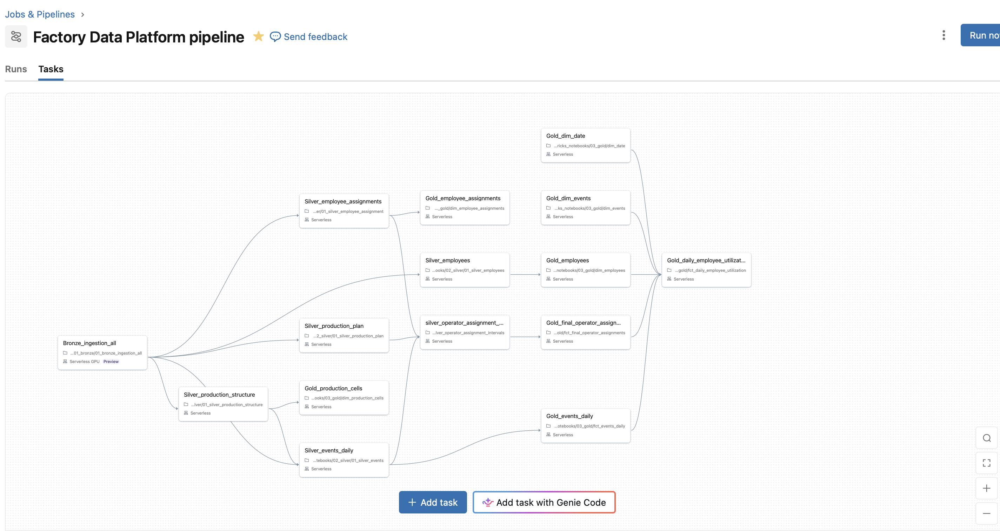

### Execution Strategy

Currently, the pipeline is configured for **on-demand (manual) execution**. This design choice optimizes compute costs during the active development phase and allows shift managers to explicitly trigger a pipeline refresh immediately after logging critical operational changes via the Streamlit application. 

Because the workflow is fully defined within the Databricks control plane, transitioning to a fully automated state (such as a nightly cron schedule or a continuous trigger based on Unity Catalog file arrival events) requires only a configuration toggle in the UI, with no changes required to the underlying notebook code.

# Presentation Layer: Power BI

The final layer of the data architecture connects directly to the Databricks Gold tables to deliver actionable insights via Power BI. This reporting layer provides transparent visibility into factory operations for employees, shift leaders, and executive management. 

While the primary focus of this project was engineering a robust, automated backend logic for interval breaking and pipeline orchestration, the initial Power BI deployment features foundational operational views that establish a baseline for future dashboard expansions.

## Semantic Model (Star Schema)


The Power BI semantic model connects directly to the Databricks SQL Warehouse, leveraging the pre-aggregated and dimensionally modeled Gold layer. By pushing the heavy computational logic (SCD2, timeline slicing, and utilization balancing) down into Databricks, the Power BI data model remains clean, and DAX measures remain lightweight and highly responsive.

## Operational Capacity Planner

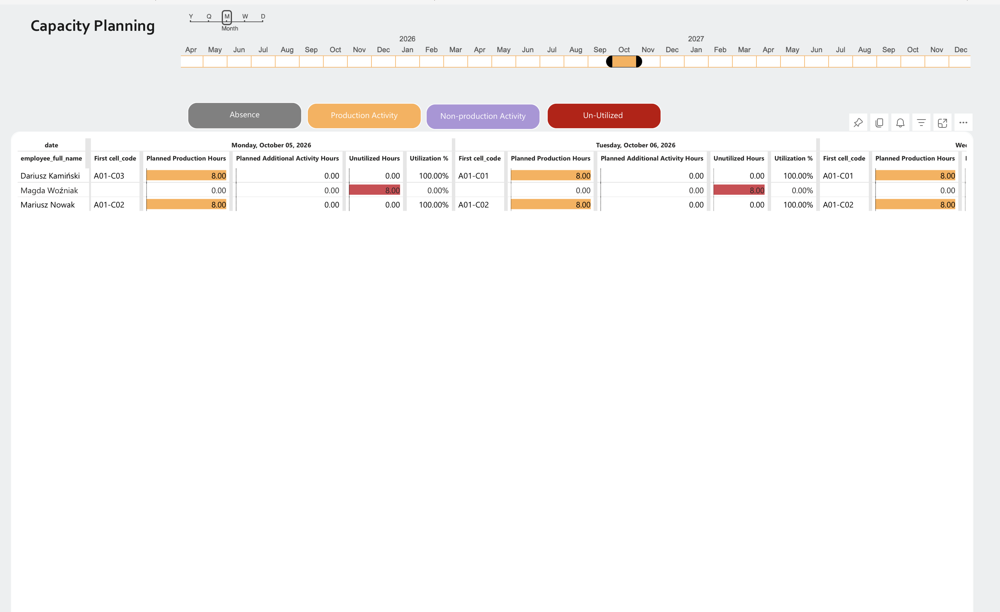

This matrix view is designed specifically for shift managers and production planners. 

* **Layout:** Operators are displayed on the rows, with calendar dates distributed across the columns.
* **Granular Breakdown:** For every employee-day intersection, the matrix provides a precise breakdown of time distribution: scheduled production hours, additional activities (e.g., training, maintenance, shift swaps), and unutilized (idle) capacity.
* **Business Value:** This view allows production planners to instantly identify workforce availability for upcoming shifts and enables executive management to monitor overall labor utilization trends across the factory floor.


# System Walkthrough and Operational Scenarios

To demonstrate the practical application of the end-to-end data pipeline, this section outlines common, real-world operational scenarios on the factory floor. These examples illustrate how the Streamlit frontend captures complex events, and how the Databricks engine successfully resolves them for Power BI reporting.

### Scenario 1: Handling an Unplanned Absence (Sick Leave)
**The Situation:** The Default Operator (Dariusz Wesoły) is scheduled for a full 8-hour shift on the A01-C01 cell. Just before the shift begins on October 8th, he reports an unplanned absence.  
**The Action:** The Shift Leader logs a "62-Absence" event from 06:00 to 14:00 specifically for this operator using the Streamlit Event Logger.  
**The Result:** The Databricks Silver layer detects the absence and automatically drops the Default Operator from the cell. In the Power BI matrix, Dariusz's planned production hours are instantly zeroed out, and the system reassigns the 8.00 production hours on cell A01-C01 to his designated Backup Operator (Marcin Kowalski).

#### Before adding absence
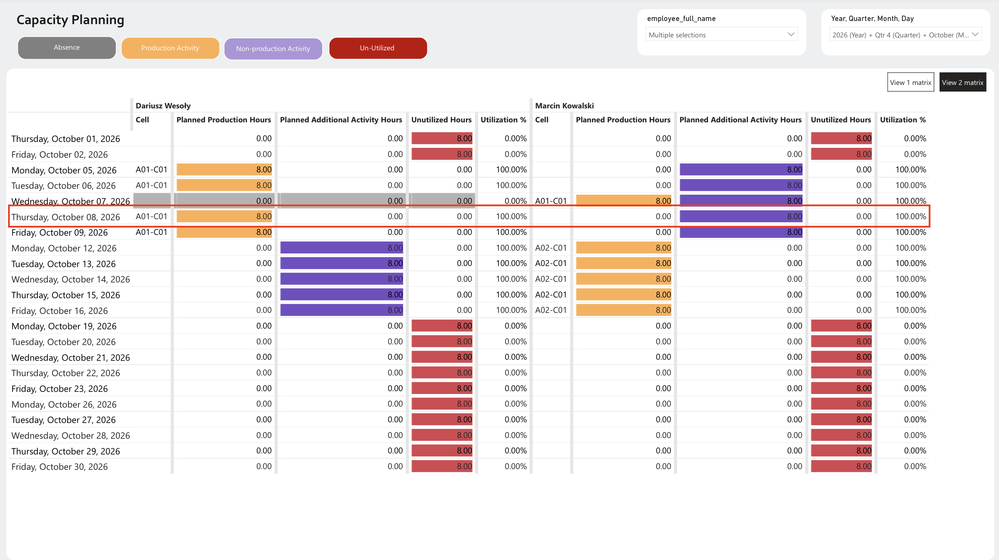

#### Adding absence in Streamlit app
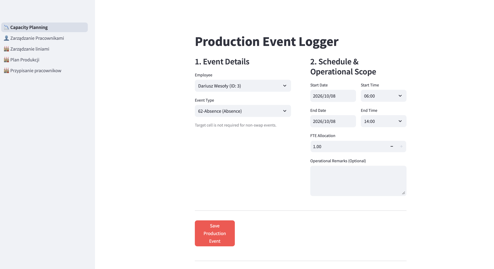

#### After
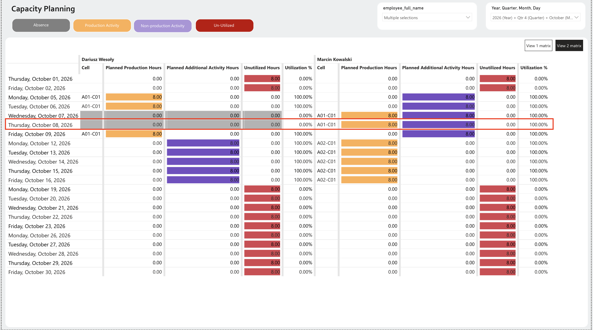


### Scenario 2: Ad-Hoc Reallocation (The "Swap") and Intra-Day Slicing
**The Situation:** An operator (Adam Narewski) needs to be reassigned to cover a different workstation for the first two hours of the shift, followed by a scheduled training session.  
**The Action:** The shift leader uses the Streamlit app to create two consecutive events: a "Swap role" assigning Adam to the "Pakowanie (A01-C04)" cell from 08:00 to 10:00, and a "Training" event from 10:00 to 14:00.  
**The Result:** The Interval Breaking algorithm strictly enforces the timeline. The Power BI dashboard reflects exactly 2.00 hours of standard production time for the swapped cell, 4.00 hours of additional activity (training), and accurately calculates 2.00 hours as unutilized capacity, resulting in a precise 75% daily utilization rate.

#### Adding swap and additional activity in one day
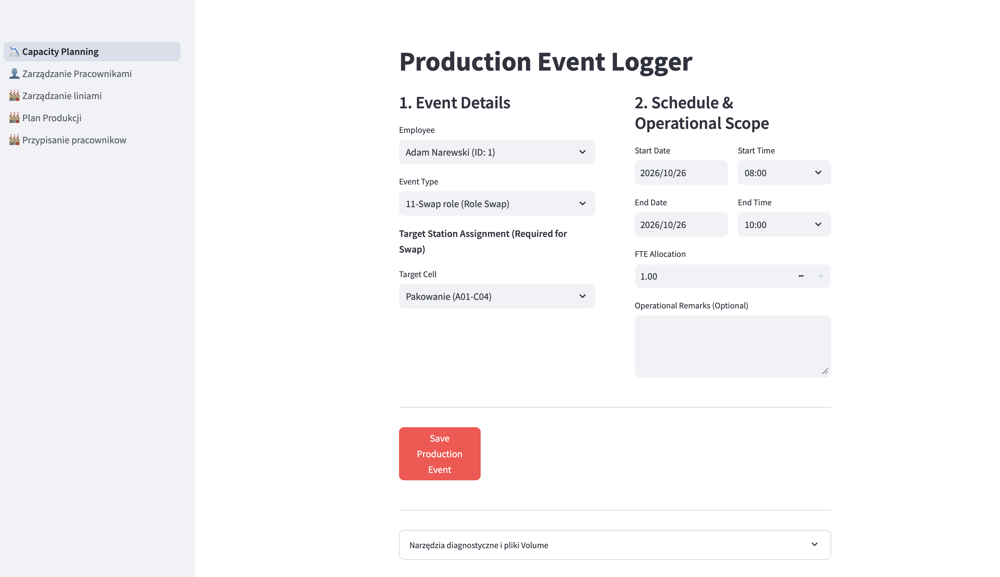

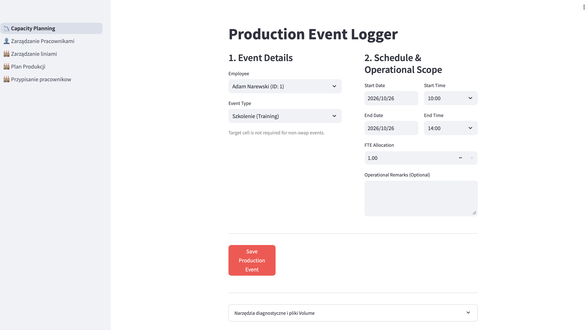

#### After
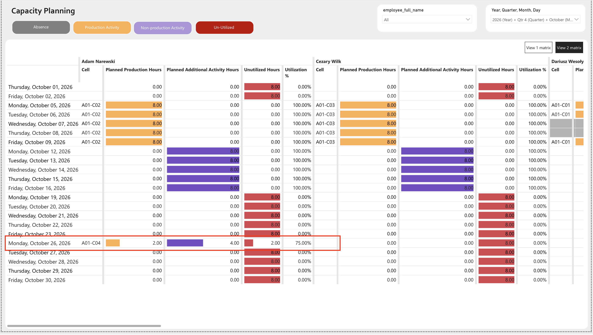


### Scenario 3: Additional Activities During Planned Downtime
**The Situation:** A production line finishes its scheduled run, and an operator (Jacek Bąk) is assigned to a week-long continuous training block spanning Monday to Friday.  
**The Action:** A planner logs a single, massive multi-day "Training" event in Streamlit, setting the start date to November 2nd at 06:00 and the end date to November 6th at 14:00.  
**The Result:** Rather than showing 104 continuous hours, the Databricks pipeline explodes the multi-day event into distinct calendar days and clamps the hours to the standard shift boundaries. The final Power BI matrix cleanly distributes exactly 8.00 hours of "Additional Activity" across each of the 5 days, ensuring the daily utilization metric never incorrectly exceeds 100%.

#### Adding Training for 5 days at once
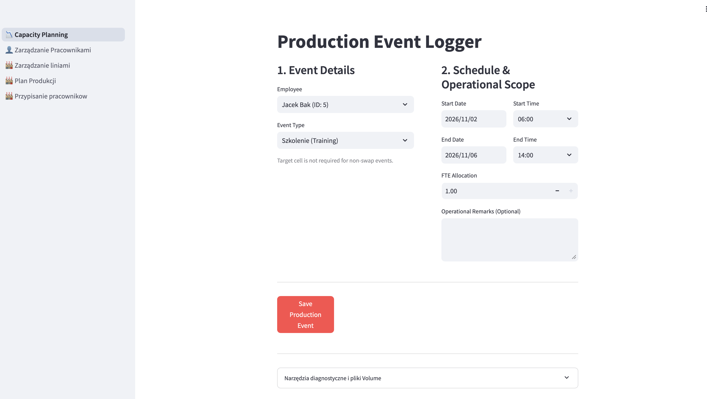

#### View after adding
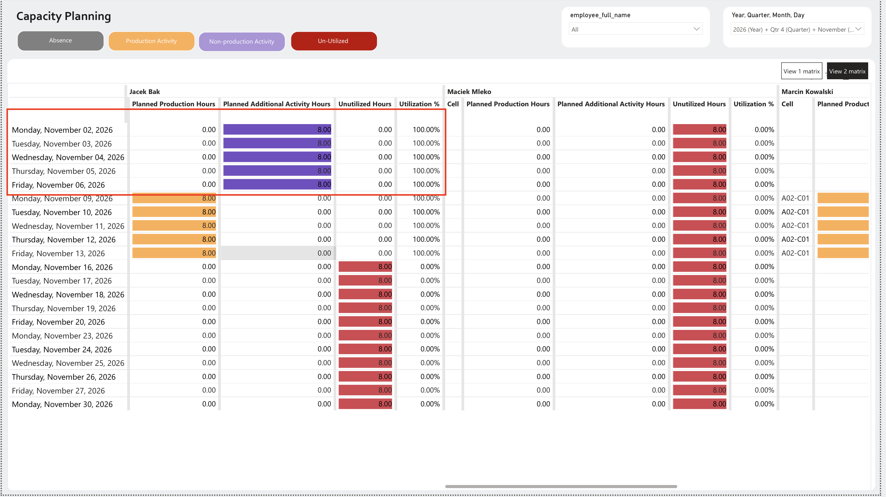
